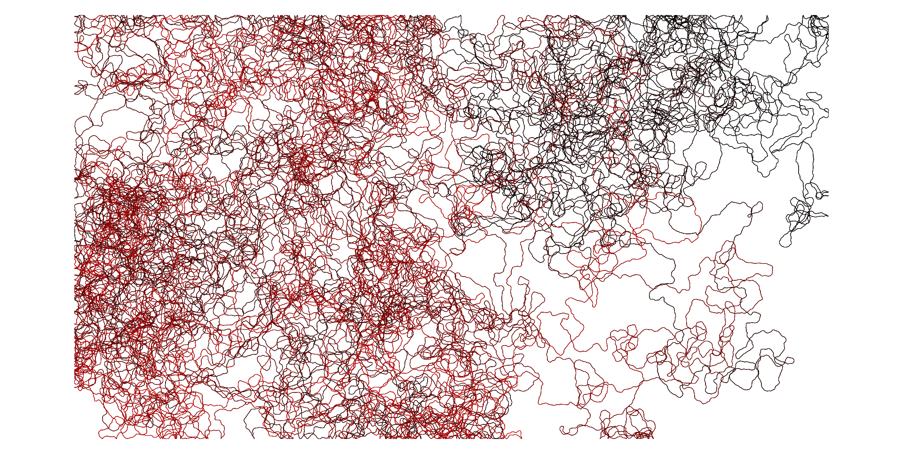

# Wandering Position Simulator
_A minimal, reproducible simulator for insect-like trajectories that create dense, meditative line drawings._

## Overview
This project simulates the path of a small insect moving on a flat surface. The model is a **correlated random walk** with reflective boundaries. The output is a continuous 2D trajectory that you can render as an artwork. It is simple, fast, and reproducible, and it provides parameters that control straightness, step size, and domain size.

<p align="center">
  


_Example output of the simulator with 1,000,000 steps, step length 0.3, kappa 50, in a 1600x900 domain._

</p>

## Inspiration
The idea is inspired by works where an artist follows the path of an insect and records its motion as a drawing. In particular, Yukinori Yanagi’s _Wandering Position_ traces the movement of a single ant within a bounded field, producing a dense web of lines that makes invisible constraints visible. This simulator recreates the aesthetic of such paths algorithmically while keeping the dynamics interpretable and minimal.

## Mathematics (short)
We model heading and position in discrete time:

- Heading update (directional persistence)
  
  $$\theta_{t+1} = \theta_t + \Delta_t,\qquad \Delta_t \sim \mathrm{vonMises}(\mu=0,\kappa)$$

  where $\kappa \ge 0$ is the concentration parameter. Larger $\kappa$ means smaller random turns and straighter motion.

- Position update (constant step length $s$)
  
  $$\mathbf{x}_{t+1} = \mathbf{x}_t + s \begin{bmatrix}\cos\theta_{t+1}\\ \sin\theta_{t+1}\end{bmatrix}$$

  where $s > 0$ is the fixed step length.

- Boundary handling (rectangular domain)
  
  If the next point exits the rectangle, we reflect it **elastically** and flip the heading across the corresponding axis. This preserves step length and creates realistic “bounces” along the edges.

This simple CRW captures short-term directional memory observed in many biological foragers while staying easy to tune and reason about.

## Features
- Correlated random walk with von Mises turning noise
- Reflective rectangular boundaries
- Reproducible randomness with a seed
- High-resolution rendering suitable for prints
- Minimal, dependency-light code

## Installation
```bash
pip install -r requirements.txt
# requirements: numpy, matplotlib
```

## Quick start (Python API)

```python
from simulator import simulate_correlated_walk
pos = simulate_correlated_walk(
    n_steps=1_000_000,
    step_length=0.3,
    kappa=50.0,
    bounds=(1600, 900),
    seed=42
)
# pos is an (N, 2) array of x,y points. Plot as you like.
```

## Parameters

* `n_steps` Number of steps to simulate. Larger values create denser drawings.
* `step_length` Size of each step in pixels or arbitrary units.
* `kappa` von Mises concentration. Higher → straighter motion; lower → more wandering.
* `bounds` `(width, height)` of the rectangular domain.
* `seed` Random seed for exact reproducibility.

### Tips

* Start with `kappa` around 20–50.
* Increase `n_steps` for denser textures; increase `bounds` to reduce density.
* For dramatic strokes, occasionally sample a larger `step_length`.
* Map speed to linewidth to emulate pen pressure (optional extension).

## How it works (implementation notes)

1. Initialize position at the center and a random heading.
2. At each step, sample a small turning angle from a von Mises distribution centered at 0.
3. Advance by a constant step.
4. If the point exits the domain, reflect the point and heading across the wall.
5. Store the path; render as connected segments with a gentle color gradient.

## Acknowledgements

Conceptually inspired by artistic practices that trace insect motion, notably Yukinori Yanagi’s *Wandering Position* series. This repository aims to provide a transparent, educational model that others can study, extend, and adapt for creative use.

## License

MIT (see `LICENSE`).
